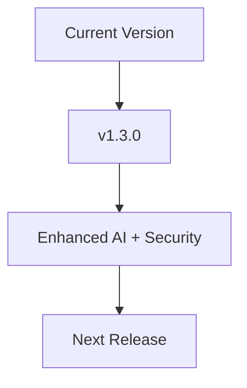

<Callout kind="info" title="Stay Updated">
Subscribe to our release notifications or check the [Autoch.at dashboard](https://dashboard.example.com/releases) regularly to stay informed about new features, security updates, and important changes.
</Callout>

## Recent Releases

Autoch.at releases updates frequently to enhance multi-channel support, AI capabilities, security, and overall performance. Review the details below to understand what's new and how it impacts your setup.

<Update label="2024-12-15" description="v1.3.0" tags={["feature", "security"]}>
## New Features

- Added support for voice channel integration in the unified timeline
- Introduced PII-aware redaction for AI processing across all channels

## Improvements

- Enhanced AI routing with keyword-based intent detection
- Optimized playbook versioning for easier rollbacks

## Bug Fixes

- Fixed handoff notifications not appearing in team inboxes
- Resolved SMS delivery status inconsistencies
</Update>

<Update label="2024-11-20" description="v1.2.0" tags={["feature", "improvement"]}>
## New Features

- Multi-channel inbox now supports real-time website chat syncing
- New analytics dashboard for conversation outcomes and follow-ups

## Improvements

- AI assistants now include training context from your business data
- Better encryption for data in transit and at rest

## Bug Fixes

- Corrected email thread fragmentation issues
- Improved performance for high-volume inboxes
</Update>

<Update label="2024-10-10" description="v1.1.0" tags={["bugfix", "breaking"]}>
## Improvements

- Unified timeline now preserves full conversation history across channels

## Bug Fixes

- Fixed AI draft generation failing on certain SMS inputs
- Patched security vulnerability in webhook endpoints

## Breaking Changes

- Updated API authentication to require `{API_KEY}` in headers only (query params deprecated)
</Update>

## Upgrade Instructions

Follow these steps to upgrade Autoch.at to the latest version.

<Steps>
  <Step title="Backup Configuration" icon="database">
    Export your current settings from the dashboard.

    <CodeGroup tabs="CLI,Dashboard">
    ````bash
    autoch.at config export --output=backup.json
    ````
    ````bash
    # Use dashboard UI: Settings > Export
    ````
    </CodeGroup>
  </Step>
  <Step title="Run Update" icon="download">
    Update via CLI or dashboard.
    
    <Tabs>
      <Tab title="CLI" icon="terminal">
      ````bash
      autoch.at update --version=latest
      ````
      </Tab>
      <Tab title="Dashboard" icon="monitor">
        Navigate to Settings > Updates and click "Upgrade Now".
      </Tab>
    </Tabs>
  </Step>
  <Step title="Verify" icon="check-circle">
    Test multi-channel sync and AI routing.
  </Step>
</Steps>

<Callout kind="tip">
After upgrading, review your playbooks for any deprecated features. Check the full migration guide in your dashboard.
</Callout>

## Quick Links

<Columns cols={3}>
  <Card title="Multi-Channel Setup" icon="message-circle" href="/configuration">
    Configure email, SMS, chat, and voice channels.
  </Card>
  <Card title="AI Assistants" icon="zap" href="/authentication">
    Set up and train your AI with business context.
  </Card>
  <Card title="Security Best Practices" icon="shield" href="/quickstart">
    Ensure PII protection and data isolation.
  </Card>
</Columns>

