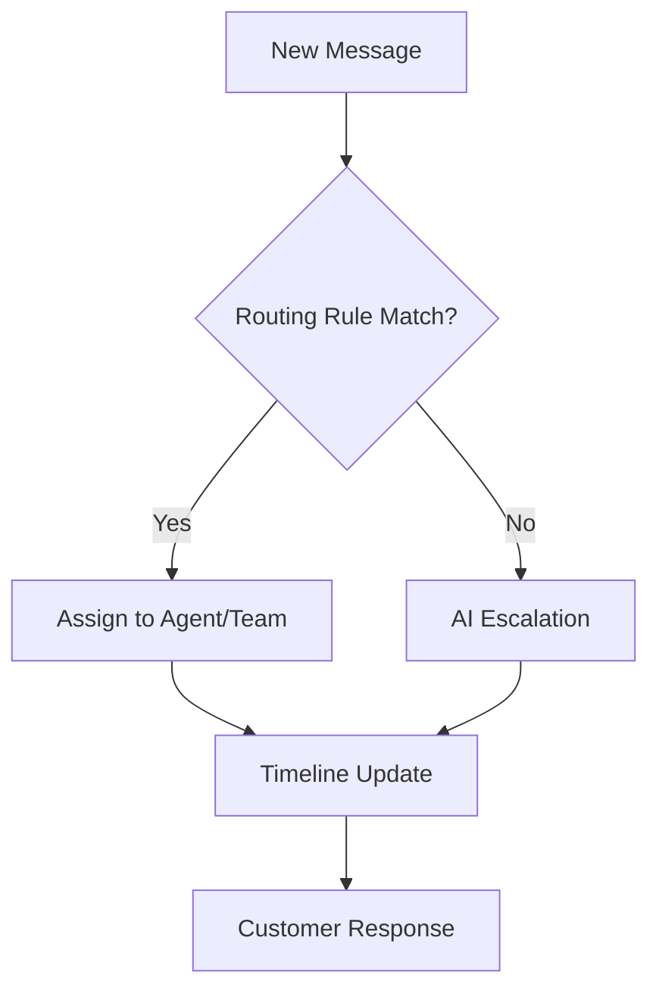

## Overview

Autoch.at unifies your customer conversations across email, SMS, website chat, and voice calls into a single shared timeline. You gain enterprise-grade tools for handling support efficiently, with AI assistance, smart routing, and performance analytics. This eliminates fragmentation, ensures context retention, and streamlines team collaboration.

<Callout kind="info">
Autoch.at's core features work together to create a seamless support experience. Start by connecting your channels, then configure AI rules and routing to automate routine tasks.
</Callout>

## Key Features

Discover the building blocks that power Autoch.at's unified communication platform.

<Columns cols={3}>
  <Card title="Multi-channel Inbox" icon="inbox" href="#multi-channel-inbox">
    One shared history across email, SMS, chat, and voice for complete context.
  </Card>
  <Card title="AI Assistants" icon="bot" href="#ai-assistants">
    Automated drafting, summarization, routing, and escalation with guardrails.
  </Card>
  <Card title="Routing & Handoffs" icon="git-branch" href="#routing-handoffs">
    Intelligent rules for directing conversations and smooth team transfers.
  </Card>
  <Card title="Analytics" icon="bar-chart-3" href="#analytics">
    Track outcomes, performance, and follow-up effectiveness.
  </Card>
</Columns>

## Multi-channel Inbox and Shared History

Combine all customer touchpoints into one inbox. You see a complete conversation timeline regardless of the channel used, preventing "repeat that?" moments and ensuring consistent responses.

### Set Up Your Multi-channel Inbox

<Steps>
  <Step title="Connect Channels" icon="link">
    Add your email, SMS provider, chat widget, and telephony integration via the dashboard.
  </Step>
  <Step title="View Unified Timeline">
    Access conversations at `https://dashboard.autoch.at/conversations` to see merged histories.
  </Step>
  <Step title="Assign Ownership">
    Tag teammates and set states like "In Progress" or "Waiting for Customer".
  </Step>
</Steps>

## AI Assistants

Leverage Quiet AI to handle routine tasks. You define rules for drafting replies, summarizing threads, routing by intent, and escalating complex issues—all with PII-aware processing and clear controls.

<Tabs>
  <Tab title="Drafting" icon="edit-3">
    AI generates response drafts based on your training context.

````javascript
// Example API call to generate draft
const response = await fetch('https://api.autoch.at/v1/conversations/{conversationId}/draft', {
  method: 'POST',
  headers: { 'Authorization': 'Bearer YOUR_API_KEY' },
  body: JSON.stringify({ prompt: 'Suggest polite follow-up' })
});
````
  </Tab>
  <Tab title="Summarizing" icon="file-text">
    Get concise thread summaries for quick catch-up.

````javascript
// Summarize conversation
const summary = await fetch('https://api.autoch.at/v1/conversations/{conversationId}/summary', {
  headers: { 'Authorization': 'Bearer YOUR_API_KEY' }
});
````
  </Tab>
  <Tab title="Routing" icon="navigation">
    Auto-route based on keywords or sentiment.

    <Callout kind="tip">
      Train AI with your business playbook for accurate routing.
    </Callout>
  </Tab>
</Tabs>

## Routing Rules, Handoffs, and Playbook Management

Define routing by channel, keyword, or intent. Use handoffs for seamless teammate transfers, and manage versioned playbooks for auditable workflows.



<Expandable title="Advanced Playbook Configuration" default-open="false">
  Create playbooks in the dashboard:

````json
{
  "rules": [
    {
      "trigger": "high-urgency",
      "action": "escalate-to-manager",
      "version": "1.2"
    }
  ]
}
````
</Expandable>

## Analytics for Outcomes and Performance

Monitor what's working with dashboards tracking response times, resolution rates, channel usage, and follow-up success.

| Metric | Description | Target |
|--------|-------------|--------|
| First Response Time | Time to initial reply | `<5min` |
| Resolution Rate | % conversations closed successfully | `>90%` |
| AI Draft Acceptance | % drafts used by agents | `>70%` |
| Follow-up Completion | % promised actions completed | `>95%` |

<CodeGroup tabs="JavaScript,Python">
```javascript
// Fetch analytics data
const analytics = await fetch('https://api.autoch.at/v1/analytics?period=30d', {
  headers: { 'Authorization': 'Bearer YOUR_API_KEY' }
});
```
```python
import requests
response = requests.get(
    'https://api.autoch.at/v1/analytics?period=30d',
    headers={'Authorization': 'Bearer YOUR_API_KEY'}
)
```
</CodeGroup>

## Next Steps

<Card title="Quickstart Guide" icon="book-open" href="/quickstart">
  Set up your first inbox in minutes.
</Card>

<Card title="Authentication" icon="key" href="/authentication">
  Secure your API access.
</Card>

<Callout kind="tip">
  Customize routing rules and AI prompts to match your support playbook for optimal results.
</Callout>