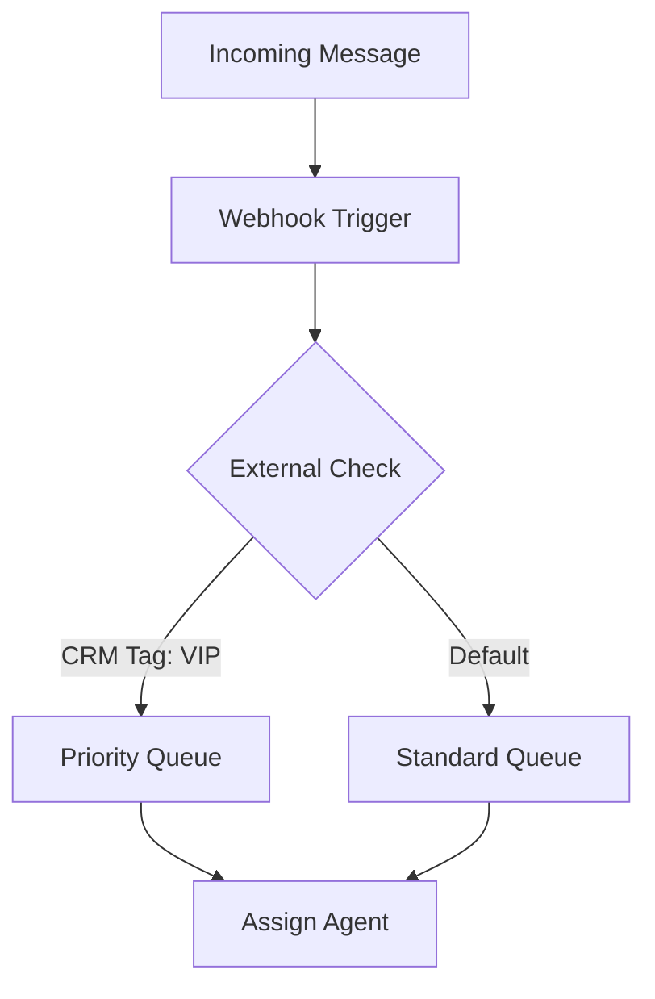

## Overview

Autoch.at supports seamless integrations with popular CRMs, email providers, and custom services. Use native connectors for quick setup or webhooks for real-time data sync. This guide covers connecting external services, webhook configuration, custom routing, and security best practices.

<Callout kind="info">
Review your integration needs and start with native options before custom webhooks.
</Callout>

## Popular Integrations

Connect Autoch.at to your favorite tools using built-in support.

<Columns cols={3}>
  <Card title="CRM Systems" icon="database" href="#crm-setup">
    HubSpot, Salesforce, Pipedrive.
  </Card>
  <Card title="Email Providers" icon="mail" href="#email-setup">
    SendGrid, Mailchimp, Postmark.
  </Card>
  <Card title="No-Code Tools" icon="zap" href="#nocode">
    Zapier, Make.com for 5000+ apps.
  </Card>
</Columns>

## Setting Up Webhooks

Webhooks enable real-time notifications for events like new messages or conversation updates.

<Steps>
  <Step title="Create Webhook" icon="plus">
    Navigate to Settings > Integrations > Webhooks. Click "New Webhook".
  </Step>
  <Step title="Configure Endpoint" icon="link">
    Enter your endpoint URL, e.g., `https://your-webhook-url.com/autoch.at`.
    
    Select events: `message.received`, `conversation.updated`.
  </Step>
  <Step title="Verify and Test" icon="check-circle">
    Save and send a test event. Check your logs for the payload.
  </Step>
</Steps>

Here is a sample webhook payload:

<Response show-lines="true">
```json
{
  "event": "message.received",
  "conversation_id": "conv_1234567890",
  "message": {
    "id": "msg_0987654321",
    "channel": "email",
    "body": "Hello from customer",
    "timestamp": "2024-01-15T10:30:00Z"
  },
  "customer": {
    "id": "cust_abcdef123456",
    "email": "customer@example.com"
  }
}
```
</Response>

## Handling Webhook Payloads

Process incoming webhooks in your backend.

<CodeGroup tabs="Node.js,Python,Ruby">
```javascript
const express = require('express');
const app = express();
app.use(express.json());

app.post('/autoch.at', (req, res) => {
  const event = req.body.event;
  if (event === 'message.received') {
    // Sync to CRM
    console.log('New message:', req.body.message);
  }
  res.status(200).json({ status: 'received' });
});

app.listen(3000);
```

```python
from flask import Flask, request, jsonify

app = Flask(__name__)

@app.route('/autoch.at', methods=['POST'])
def webhook():
    data = request.json
    event = data['event']
    if event == 'message.received':
        print('New message:', data['message'])
    return jsonify({'status': 'received'}), 200
```

```ruby
require 'sinatra'
require 'json'

post '/autoch.at' do
  data = JSON.parse(request.body.read)
  event = data['event']
  if event == 'message.received'
    puts "New message: #{data['message']}"
  end
  status 200
  { status: 'received' }.to_json
end
```
</CodeGroup>

## Integration Methods

Choose the best method for your use case.

<Tabs>
  <Tab title="Native Connectors" icon="plug">
    Use pre-built integrations for zero-code setup.
    
    <ParamField path="integration_id" param-type="string" required="true">
      ID from Autoch.at dashboard.
    </ParamField>
    
    <ParamField header="Authorization" param-type="string" required="true">
      `Bearer YOUR_API_KEY`.
    </ParamField>
  </Tab>
  <Tab title="Zapier" icon="zap">
    Connect via Zapier for multi-step automations.
    
    1. Search for "Autoch.at" in Zapier.
    2. Authenticate with `YOUR_API_KEY`.
    3. Map fields like `conversation_id` to actions.
  </Tab>
  <Tab title="Custom API" icon="code">
    Use REST API for advanced control.
    
    ```bash
    curl -X POST https://api.example.com/v1/conversations \
      -H "Authorization: Bearer YOUR_API_KEY" \
      -d '{"channel": "sms", "body": "Follow up"}'
    ```
  </Tab>
</Tabs>

## Custom Routing with Integrations

Route conversations based on external data.



<Expandable title="Advanced Routing Rules" default-open="false">
Set rules like: If HubSpot deal value `{>10000}`, route to sales team.
</Expandable>

## Security Best Practices

Protect data during integrations.

<Callout kind="alert" title="Security First">
Always use HTTPS endpoints. Validate signatures with `X-Autoch.at-Signature` header using HMAC SHA-256 and your webhook secret.
</Callout>

| Practice | Description |
|----------|-------------|
| HTTPS Only | Encrypt all traffic |
| Signature Verification | Validate payload integrity |
| Least Privilege | Use read-only API keys where possible |
| Rate Limiting | Prevent abuse on your endpoints |

## Next Steps

<Columns cols={2}>
  <Card title="API Reference" icon="book-open" href="/authentication">
    Full API docs and auth setup.
  </Card>
  <Card title="Troubleshooting" icon="help-circle" href="/help-center">
    Common integration issues.
  </Card>
</Columns>