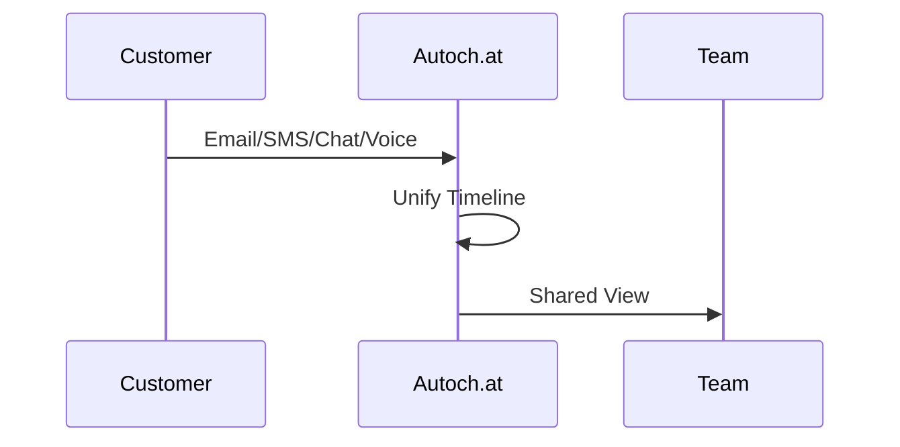

## Prerequisites

<Callout kind="info" title="Before You Begin">
Ensure you have:
- A valid email address for account creation
- Access to your communication providers (e.g., Gmail, Twilio for SMS, Intercom for chat)
- Team member emails ready for invitations
- Admin access to your domain or phone numbers
</Callout>

Review these requirements to avoid delays during setup.

## Create Your Account

Sign up for Autoch.at in under 2 minutes.

<Steps>
  <Step title="Sign Up" icon="user-plus">
    Visit `https://app.autoch.at/signup` and enter your email and password.

    Choose your team name, like "Support Team" or "Sales Crew".
  </Step>
  <Step title="Verify Email" icon="mail">
    Check your inbox for the verification link from Autoch.at.

    Click the link to activate your account.
  </Step>
  <Step title="Log In" icon="log-in">
    Return to `https://app.autoch.at/login` and sign in with your credentials.

    Complete the quick onboarding survey about your channels.
  </Step>
</Steps>

## Connect Communication Channels

Autoch.at unifies email, SMS, chat, and voice. Connect them one by one using secure OAuth or API keys.

<Tabs>
  <Tab title="Email (Gmail)" icon="mail">
    <Steps>
      <Step title="Authorize Gmail">
        In the dashboard, select **Channels > Email > Add Gmail**.

        Click **Connect** and grant permissions for read/send access.
      </Step>
      <Step title="Test Connection">
        Send a test email to `test@autoch.at` from your Gmail.

        Verify it appears in your unified inbox.
      </Step>
    </Steps>
  </Tab>
  <Tab title="SMS (Twilio)" icon="phone">
    ```bash
    # Get your Twilio credentials from console.twilio.com
    Account SID: ACxxxxxxxxxxxxxxxxxxxxxxxxxxxxxxxx
    Auth Token: your_auth_token_here
    Phone Number: +1-555-123-4567
    ```

    <Steps>
      <Step title="Add Twilio">
        Go to **Channels > SMS > Twilio**.

        Enter your Account SID, Auth Token, and phone number.
      </Step>
      <Step title="Verify">
        Send an SMS to your Twilio number.

        Confirm receipt in Autoch.at timeline.
      </Step>
    </Steps>
  </Tab>
  <Tab title="Website Chat" icon="message-circle">
    Copy the embed script from **Channels > Chat**.

    <Expandable title="Chat Widget Code" default-open="true">
    ````html
    <script src="https://widget.autoch.at/embed.js"></script>
    <autoch-at-chat
      api-key="YOUR_API_KEY"
      theme="light">
    </autoch-at-chat>
    ````
    </Expandable>

    Paste it into your website's `<head>` or before `</body>`.
  </Tab>
  <Tab title="Voice (Twilio Voice)" icon="phone-call">
    Use the same Twilio account for voice.

    Enable **Voice Channels** in **Channels > Voice** and configure webhooks:

    <CodeGroup tabs="Webhook URL">
    ````json
    {
      "url": "https://api.autoch.at/webhooks/voice/inbound",
      "method": "POST"
    }
    ````
    </CodeGroup>
  </Tab>
</Tabs>

## Configure Initial Settings and Team Access

Set up your workspace basics.

<Steps>
  <Step title="Invite Team Members" icon="users">
    Navigate to **Team > Invites**.

    Add emails like `team@yourcompany.com` and assign roles: Admin, Agent, Viewer.
  </Step>
  <Step title="Set Business Hours" icon="clock">
    Go to **Settings > Schedule**.

    Define `9 AM - 6 PM PST` for auto-replies outside hours.
  </Step>
  <Step title="Enable AI Assistants" icon="bot">
    Toggle **AI > Quiet AI** on.

    Train with sample responses for your top queries.
  </Step>
</Steps>

## View Your First Unified Conversation Timeline

Once channels are connected, test with a real message.

1. Send an email to your connected Gmail.
2. Text your SMS number.
3. Chat via your website widget.

All appear in **Inbox > Unified Timeline` as one thread with shared history.



<Callout kind="success">
  Congratulations! Your conversations are now unified. Monitor the timeline for handoffs and AI drafts.
</Callout>

## Next Steps

<Columns cols={3}>
  <Card title="Authentication" icon="shield" href="/authentication">
    Secure your API access and webhooks.
  </Card>
  <Card title="AI Configuration" icon="bot" href="/configuration">
    Customize Quiet AI rules and playbooks.
  </Card>
  <Card title="Analytics" icon="bar-chart-3" href="/concepts/analytics">
    Track conversation outcomes.
  </Card>
</Columns>

Explore [Introduction](/introduction) for an overview or [Changelog](/changelog) for updates.